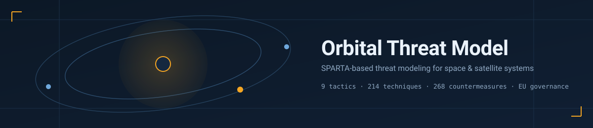
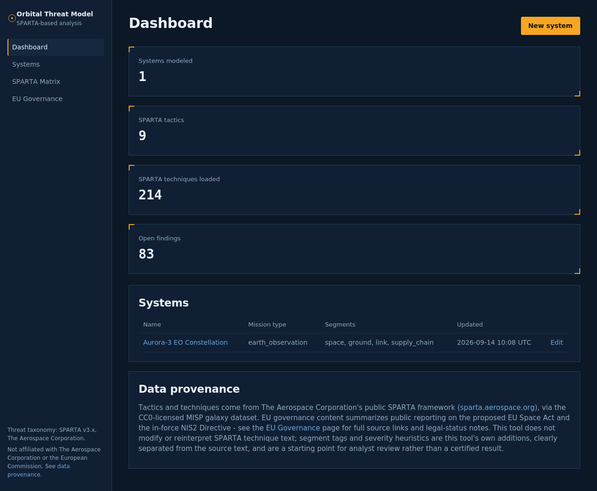
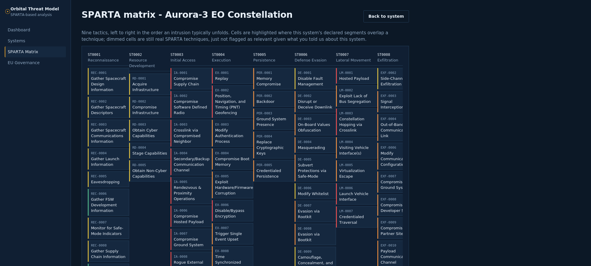
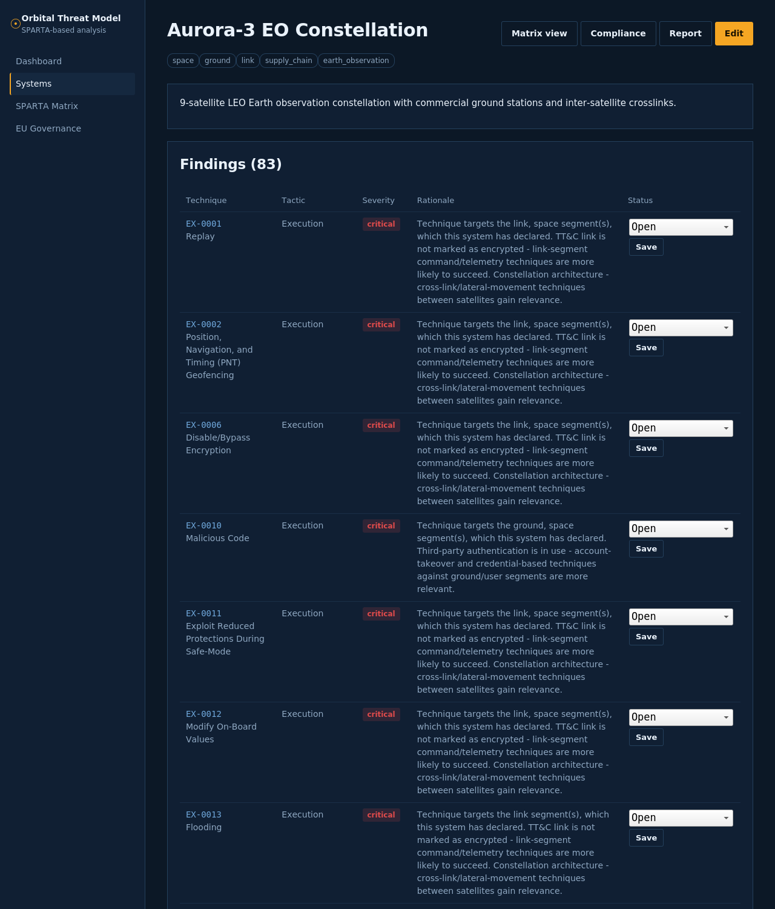
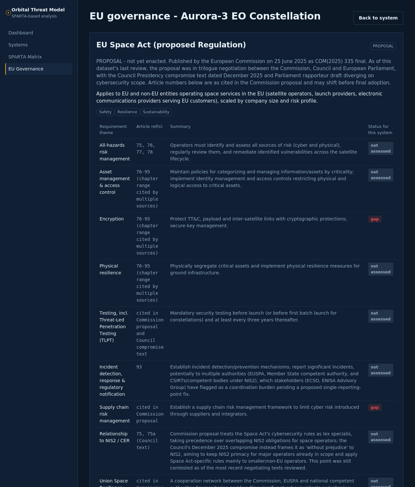

<p align="center">
  
</p>

<p align="center">
  <a href="https://github.com/RisingCyber/orbital-threat-model/actions/workflows/tests.yml"></a>
  
  
  
  
</p>

<p align="center">
  <b>Threat-model space and satellite systems against SPARTA, then check the result against EU space cybersecurity governance - in one tool.</b>
</p>

---

## Contents

- [Why this exists](#why-this-exists)
- [What it does](#what-it-does)
- [Quickstart](#quickstart)
- [Architecture](#architecture)
- [Data provenance](#data-provenance)
- [Security posture](#security-posture)
- [Known limitations](#known-limitations)
- [Extending it](#extending-it)
- [License](#license)

## Why this exists

Threat modeling a satellite mission usually means an analyst with deep domain
knowledge working through a spreadsheet or a whiteboard against a framework
like SPARTA by hand. That's valuable work, and it's also slow to start and
easy to leave stale once the architecture changes.

This tool gives that analyst a running start: describe the system once, get
back a SPARTA-based matrix filtered and severity-ranked for the segments that
system actually has, then see the same system checked against the EU's
current and proposed space cybersecurity governance. Every finding traces
back to a real SPARTA technique ID and a rule you can read in the source -
nothing here is generated prose standing in for analysis.

## What it does

- **Describes a system once** - mission type, deployment segments (space /
  ground / link / user / launch / supply chain), and a handful of risk
  flags (encrypted TT&C, third-party auth, supply-chain program, and so on).
- **Generates a SPARTA-based finding set** - a deterministic engine matches
  the system's declared segments against 214 real SPARTA techniques and
  ranks them by a documented, capped severity heuristic. Every finding
  carries a plain-language rationale.
- **Shows the full matrix** - a filterable heatmap across all 9 SPARTA
  tactics, styled like an intrusion timeline rather than a spreadsheet.
- **Checks EU governance alignment** - a compliance page maps the system
  against the proposed EU Space Act's resilience requirements and the
  in-force NIS2 Directive, and is explicit about which requirements it can
  actually assess versus which ones need a human.
- **Writes an analyst report** - a printable page combining the findings and
  the compliance checklist for a given system.
- **Optionally adds an AI-written narrative** - if you set
  `ANTHROPIC_API_KEY`, the system page gets a short prioritization paragraph
  from Claude. It's structurally unable to introduce a finding the
  deterministic engine didn't already select - see
  [Security posture](#security-posture).

## Screenshots

<table>
<tr><td></td></tr>
<tr><td align="center"><i>Dashboard - systems modeled, reference-data counts, open findings.</i></td></tr>
</table>

<table>
<tr><td></td></tr>
<tr><td align="center"><i>SPARTA matrix filtered for one system. Dimmed cells are real techniques that don't overlap this system's declared segments; the grid scrolls horizontally for the 9th tactic column.</i></td></tr>
</table>

<table>
<tr><td></td></tr>
<tr><td align="center"><i>Findings ranked highest-severity-first, each with its rationale and an inline status control.</i></td></tr>
</table>

<table>
<tr><td></td></tr>
<tr><td align="center"><i>EU governance checklist - "addressed" / "gap" / "not assessed" per requirement, never a guess dressed up as a pass.</i></td></tr>
</table>

Some screenshots of the running app - ESA's Aurora Space Earth Observation Constellation Sats.

## Quickstart

```bash
git clone https://github.com/RisingCyber/orbital-threat-model.git
cd orbital-threat-model
python3 -m venv venv && source venv/bin/activate
pip install -r requirements.txt
cp .env.example .env          # fill in SPARTA_SECRET_KEY for anything beyond a quick local look
python run.py
```

Visit `http://127.0.0.1:5000`. In debug mode a random session key is
generated automatically, so you can click around without setting
`SPARTA_SECRET_KEY` first - it just won't survive a restart.

## Architecture

```
config.py            env-driven config, no hardcoded secrets
app/__init__.py       app factory: CSRF, CSP, secure cookies, blueprint registration
app/models.py         SQLAlchemy ORM models (Tactic, Technique, Mitigation, SpaceSystem, Finding)
app/data/*.json       bundled reference data - see Data provenance
app/data_loader.py     idempotent sync of app/data/*.json into the DB
app/engine.py          deterministic segment-based technique matching + severity heuristic
app/ai_assist.py       OPTIONAL AI narrative, hard-constrained to engine.py's own output
app/forms.py           WTForms with server-side validation and CSRF tokens
app/routes/            blueprints: main, systems, matrix, compliance, reports
app/templates/         Jinja2 templates, autoescaped, no |safe anywhere
app/static/            CSS/JS, no remote dependencies (CSP is default-src 'self')
tests/test_smoke.py     black-box HTTP tests, including two regression tests for real bugs found during development
```

## Data provenance

**SPARTA tactics, techniques, and countermeasures** (`app/data/sparta_*.json`)
come from The Aerospace Corporation's public SPARTA framework
([sparta.aerospace.org](https://sparta.aerospace.org/)), pulled from the
CC0-licensed MISP galaxy mirror of the official STIX feed
(`MISP/misp-galaxy`, `clusters/sparta-*.json`). Tactic IDs (ST0001-ST0009)
were verified individually against the live SPARTA site, not assumed.
Technique text is reproduced as-is; this tool doesn't edit or reinterpret it.

**This tool's own additions**, layered on top of and clearly separated from
that source text:
- `segments` tags on each technique - a keyword heuristic guessing which
  deployment segment a technique's own text is about. This is **not** an
  official SPARTA mapping (SPARTA doesn't publish one) and is worth
  spot-checking before you rely on it.
- The severity heuristic in `app/engine.py` - a documented, capped scoring
  rule (a baseline by tactic, at most one tier of adjustment from a small
  set of named risk conditions), designed to be legible rather than
  precise.

**EU governance data** (`app/data/eu_governance.json`) summarizes cited,
public reporting on the EU Space Act proposal (COM(2025) 335, published 25
June 2025, still in legislative negotiation - article numbers may still
change) and the in-force NIS2 Directive ((EU) 2022/2555). Every entry lists
its sources and legal status. Re-verify against the current legal text (or
counsel) before using this for an actual filing.

## Security posture

Built against the OWASP Top 10 classes most relevant to a CRUD-style Flask
app, not bolted on after:

| Risk | Mitigation |
|---|---|
| SQL injection | Every query goes through the SQLAlchemy ORM. No hand-built SQL string exists in the codebase. |
| XSS | Jinja2 autoescaping on every template; no `\|safe` or `Markup()` on any user- or AI-generated text, including the optional AI narrative. |
| CSRF | Flask-WTF issues and checks a token on every POST (`tests/test_smoke.py::test_missing_csrf_token_is_rejected`). |
| Missing security headers | Flask-Talisman sets a strict `default-src 'self'` CSP, `X-Content-Type-Options: nosniff`, `X-Frame-Options: DENY`, and HSTS outside debug mode. No inline `<script>`/`<style>`, no remote CDN dependency. |
| Secret leakage | `SPARTA_SECRET_KEY` and `ANTHROPIC_API_KEY` are environment-only; the app refuses to start with no secret key outside debug mode. |
| Oversized requests | `MAX_CONTENT_LENGTH` caps request bodies at 2MB. |
| AI hallucination reaching the UI | `app/ai_assist.py` regex-scans its own model output for anything that looks like a technique ID and discards the narrative if it references an ID the deterministic engine didn't already select. The model can describe a finding; it cannot invent one. |

If you find a gap in this table, please treat it as a bug.

## Known limitations

- SPARTA's official countermeasure-to-technique mapping isn't mirrored at
  technique-level granularity - the source data doesn't expose that edge
  directly, and building an unofficial one risked fabricating a mapping
  SPARTA itself hasn't published. Technique pages link to the real
  [Countermeasure Mapper](https://sparta.aerospace.org/countermeasures)
  instead.
- The `segments` heuristic is a first pass, not ground truth.
- EU governance article numbers are a moving target while the Space Act is
  in trilogue - the dataset says so explicitly rather than picking one
  source's numbering as final.
- The AI narrative layer needs an Anthropic API key and network access; the
  app is fully functional without it.

## Testing

```bash
pip install -r requirements.txt pytest
pytest -q
```

Two of the tests exist because the behavior actually broke during
development, not because they looked good to write:

- `test_severity_is_not_all_critical` - an earlier version of the severity
  heuristic stacked risk-modifier bumps without a ceiling, and one modifier
  applied to 80% of the technique catalog. Real test data came back with
  85% of findings marked "critical," which made prioritization meaningless.
  Fixed by capping the bump at one tier and narrowing that modifier's scope.
- `test_findings_are_ranked_by_actual_severity_not_alphabetically` - the
  findings table sorted by `Finding.severity.desc()` in SQL, which ranks the
  *string* alphabetically ("medium" outranks "critical" because `m > c`).
  Findings now sort in Python against an explicit severity-rank mapping.

CI (`.github/workflows/tests.yml`) runs the full suite on Python 3.11 and
3.12 for every push and pull request, then separately verifies the app
boots and loads all 9 tactics, 200+ techniques, and 100+ countermeasures.

## Extending it

- **Refresh SPARTA data**: re-pull `clusters/sparta-*.json` from
  `MISP/misp-galaxy`, and re-verify tactic IDs against sparta.aerospace.org
  before trusting a new SPARTA version's numbering.
- **Refresh EU governance data**: re-check the sources cited in
  `app/data/eu_governance.json` against the current legislative text; update
  `status` and `article_refs` accordingly.
- **Tune the heuristics**: segment tagging and severity scoring live
  entirely in `app/engine.py` and the `segments` field of the technique
  data, both written to be legible enough to adjust without touching the
  rest of the app.


## License

[MIT](LICENSE) for the application code. Bundled SPARTA reference data is
CC0 (The Aerospace Corporation, via MISP galaxy); the EU governance dataset
is this project's own summary of public sources, not a legal text - see
[Data provenance](#data-provenance).
